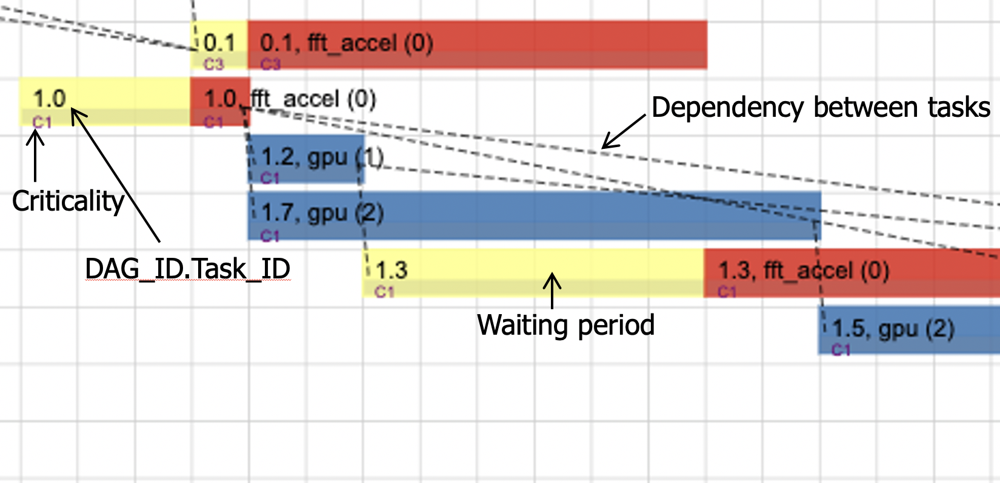

# AVSched: Quality-of-Mission Aware Scheduling for Autonomous Vehicle SoCs
AVSched is a multi-step scheduler that leverages dynamic runtime information about the underlying heterogeneous hardware platform, along with the applications’ real-time constraintsand the task traffic in the system to optimize overall mission performance. AVSched proposes two scheduling policies: 𝑀𝑆𝑠𝑡𝑎𝑡 and 𝑀𝑆𝑑𝑦𝑛 and scheduling optimizations like task pruning, hybrid heterogeneous ranking and rank update.

## STOMP: Scheduling Techniques Optimization in heterogeneous Multi-Processors
AVSched is implemented using the STOMP simulator. STOMP is a simple yet powerful queue-based **discrete-event** simulator that enables fast implementation and evaluation of OS scheduling policies in multi-core/multi-processor systems. It implements a convenient interface to allow users and researchers to _plug in_ new scheduling policies in a simple manner and without the need to touch the STOMP code.

STOMP is based on its predecesor C-based <a href="https://ieeexplore.ieee.org/document/5749737" target="_blank">QUTE framework</a>.


## Usage

STOMP is invoked using the `stomp_main.py` script which supports the following options:
```
optional arguments:
  -h, --help            show this help message and exit
  --conf-file CONF_FILE, -c CONF_FILE
                        specifies a json configuration file for STOMP to use this run
  --input-trace INPUT_TRACE, -i INPUT_TRACE
                        specifies the filename from which STOMP should read an input DAG trace
  --conf-json CONF_JSON, -j CONF_JSON
                        specifies a json string that includes the configuration information for STOMP to use this run
  --debug, -d           Output run-time debugging messages
```

## Traces

STOMP supports a trace-driven operational mode. A trace file can be generated using the trace_generator.py script in utils/ to create random uniform arrival of directed acyclic graphs  (DAGs).
Once a trace has been generated, subsequent STOMP runs can use that trace in the following mode:

 * **Input-trace mode** : this means that the STOMP simulation will faithfully use the DAG type, arrival time, and deadline from the input trace.  This limits the ability of parameter changes (e.g. alterations in the mean service times, or the standard deviation) to affect the run-time behavior, since the DAG arrival times are taken from the input trace.  This does allow one to isolate the impact (in some sense) of the scheduling policy on overall performance.


## Requirements

The requirements to run STOMP are listed in `requirements.txt`.

## Running STOMP
STOMP can be run with the default parameters:
```
make run_syn # For synthetic application
make run_ad  # For the ADSuite application
```
STOMP can be configured using the `inputs/stomp.json` for the synthetic application and `inputs/stomp_real.json` for the real-world applications. 
The inputs required to run STOMP are organized in `inputs`. It contains a folder per application.

Also checkout the script `run_all.py` in utils to run multiple runs and `collect.py` to collect the stats for varying scheduling policies and parameters. To run and collect stats for preloaded parameters and all scheduling policies run:
```
./utils/run_all.py -ucsv
./utils/collect.py <output_sim_dir> <application_name> 
```

## STOMP-Viz
STOMP-Viz is a utility based on the [Python-Gantt](https://pypi.org/project/python-gantt) project.
```
python3 utils/stomp-viz.py
```
STOMP-viz takes as inputs:
  - CSV dump file produced during STOMP’s execution
  - Start and stop timesteps from the user (optional)

STOMP-viz outputs different views of tasks' execution over time
  - Grouped by server type (e.g. CPU, GPU, accelerator)
  - Grouped by arrival time (chronologically)
  - Server utilization view

A screenshot of the output of STOMP-viz on an example trace execution is shown below.


## Contributors and Current Maintainers

 * Aporva Amarnath (IBM) -- aporva.amarnath@ibm.com
 * Augusto Vega (IBM) --  ajvega@us.ibm.com
 * John-David Wellman (IBM) -- wellman@us.ibm.com


## Do You Want to Contribute? Contact Us!

 * Aporva Amarnath (IBM) -- aporva.amarnath@ibm.com
 * Augusto Vega (IBM) --  ajvega@us.ibm.com
 * John-David Wellman (IBM) -- wellman@us.ibm.com
